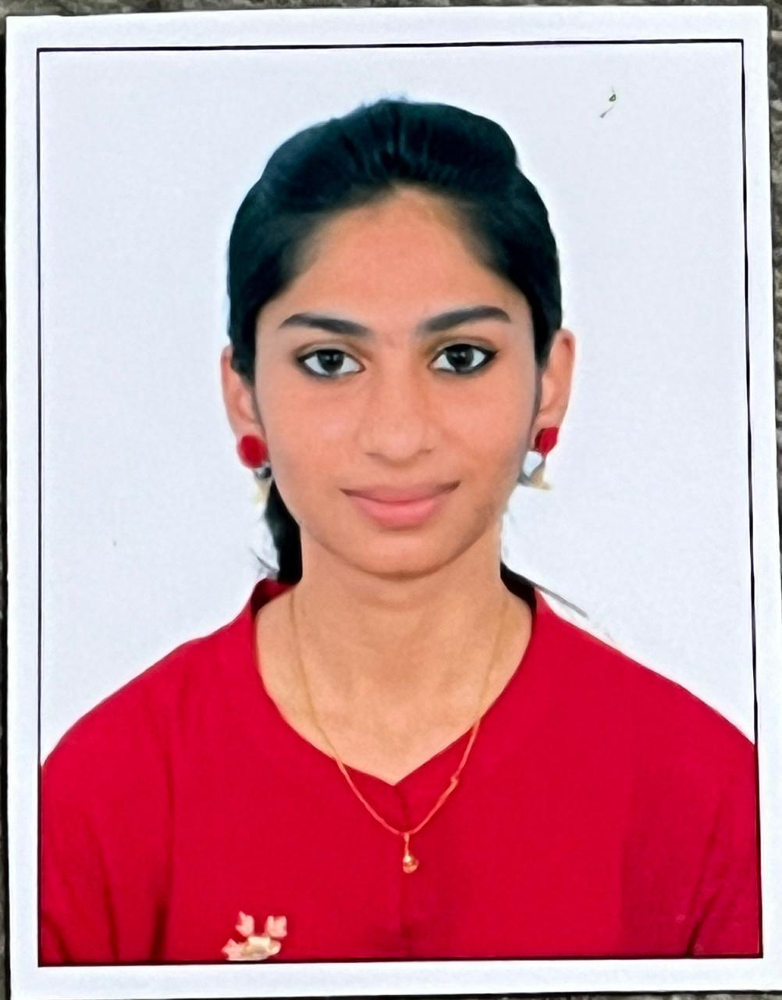

## 🧑‍💻 Portfolio — Mohammad Rahimunissa Begum

### 🌐 Live Demo

👉 [Your Portfolio Link](#)
*(You can replace `#` with your actual GitHub Pages or Netlify link once deployed)*

---

### 📋 About

This is a **personal portfolio website** built using **HTML, CSS, and JavaScript**.
It showcases my **skills, projects, education, and contact information** in a simple, modern, and responsive layout with a **light color theme**.

---

### 🧠 Features

* Clean and responsive layout
* Modern light theme
* Highlighted skills and projects
* Contact links (LinkedIn, GitHub, Email)
* Minimal animations and hover effects
* Easy to customize and extend

---

### 🏗️ Tech Stack

* **HTML5** — Structure
* **CSS3** — Styling and layout
* **JavaScript** — Interactivity
* **Google Fonts (Poppins)** — Typography

---

### 📁 Project Structure

```
portfolio/
├── index.html        # Main HTML file
├── style.css         # Stylesheet
├── script.js         # Optional JS interactivity
└── mypic.jpeg        # Profile image
```

---

### 🖼️ How to Add Your Image

1. Rename your image to `mypic.jpeg` (or any name you prefer).
2. Place it inside the project folder.
3. If you’re using the CSS background method, update:

   ```css
   .photo {
     background: url('mypic.jpeg') center/cover no-repeat;
   }
   ```
4. Or if you’re using `` in HTML:

   ```html
   
   ```

---

### 🚀 How to Run

1. Download or clone this repository:

   ```bash
   git clone https://github.com/yourusername/portfolio.git
   ```
2. Open `index.html` in your browser.
3. *(Optional)* Deploy it using:

   * **GitHub Pages**
   * **Netlify**
   * **Vercel**

---

### 🧩 Customization

* Edit `index.html` → update your **name, contact info, and project details**.
* Adjust colors in `:root` (inside CSS) to match your personal branding.
* Add new projects or sections by duplicating existing `<section>` blocks.

---

### 📬 Contact

**Mohammad Rahimunissa Begum**

📧 [roohimazzu@gmail.com](mailto:roohimazzu@gmail.com)

🔗 [LinkedIn](https://linkedin.com/in/roohi-md-045126315)

💻 [GitHub](https://github.com/Roohi15-bot)

---

### 🪪 License

This project is **open-source** and available under the [MIT License](LICENSE).

---

Would you like me to add a **GitHub Pages deployment guide** at the end of this README (step-by-step)? It makes it easier to publish your portfolio live.
